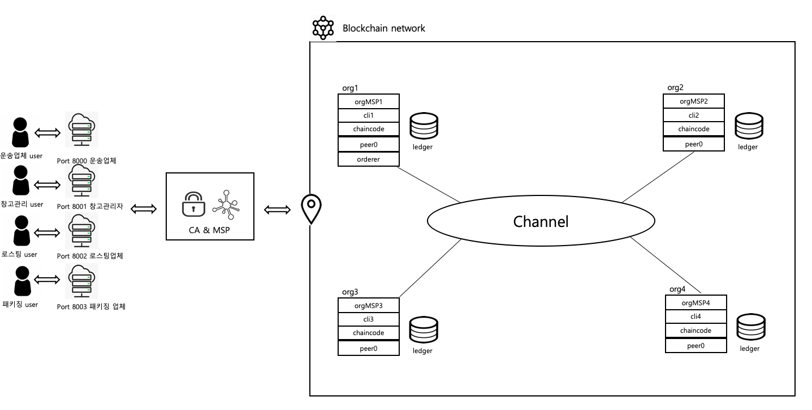
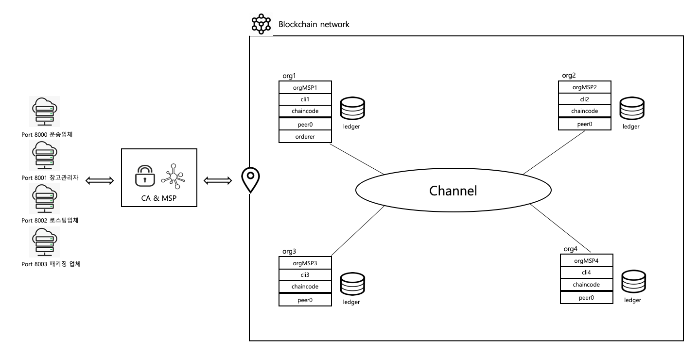

# Walton_final_project
This project is upgrade version about the circle system of coffee seed.

  
# Compare with first project version

- first version  
Each organization has node servers, so there are only four express servers. This is very inefficient.

   

- second version  
Version 2 complements the inefficient configuration in version 1 by reducing the express server from four to one.

