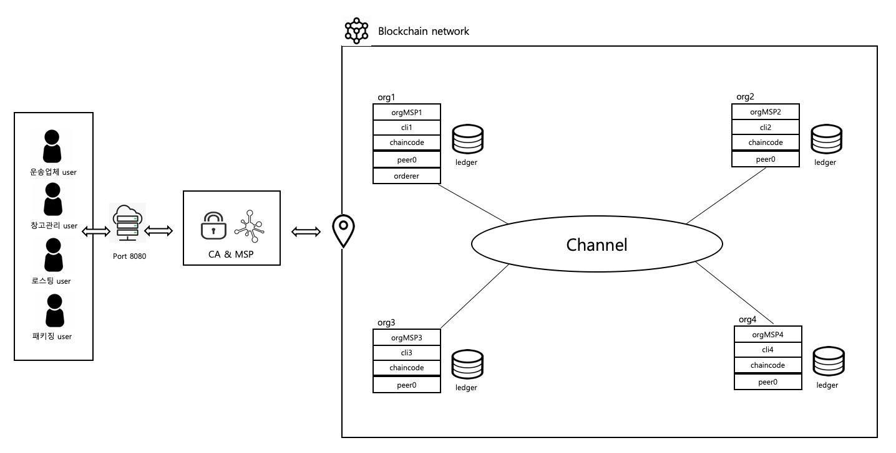
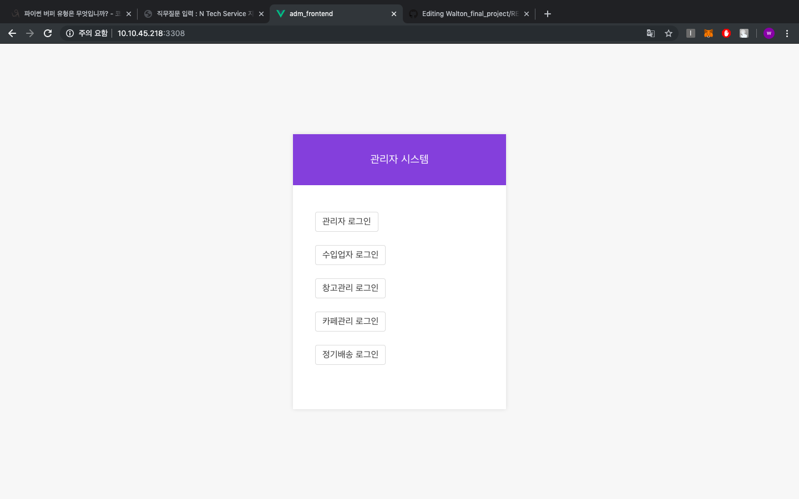
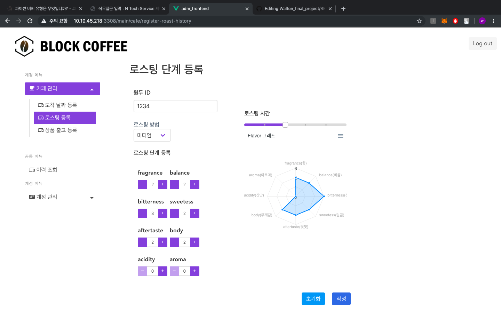
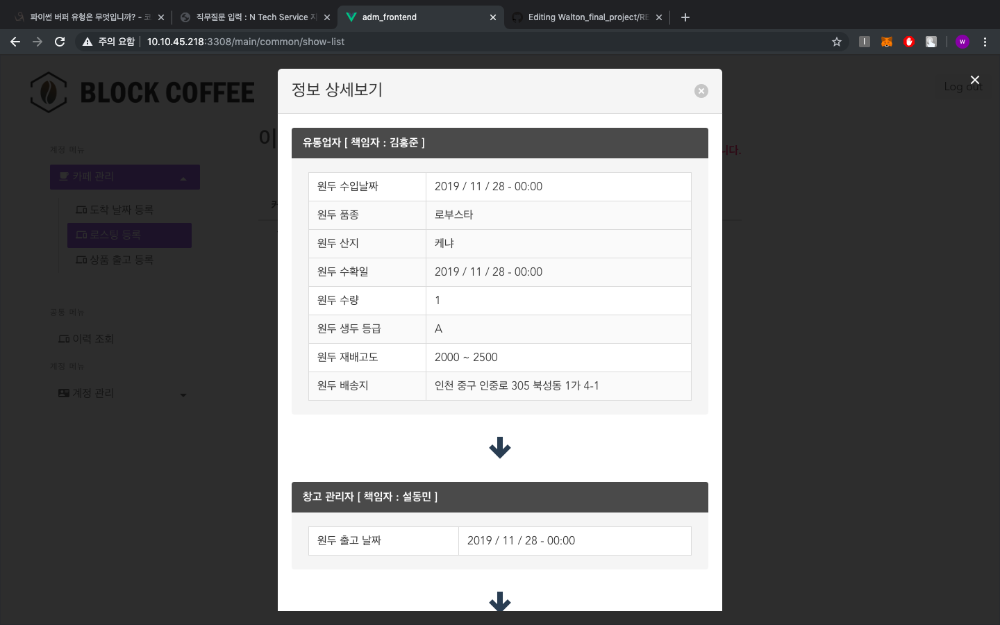

# Walton_final_project
This project is upgrade version about the circle system of coffee seed.

  
# Compare with first project version

- first version  
Each organization has node servers, so there are only four express servers. This is very inefficient.

   

- second version  
Version 2 complements the inefficient configuration in version 1 by reducing the express server from four to one. In addition, real-time transaction event alarm service UI was added.

# Getting start

1. Start Hyperledger network   
: cd network  
: ./start.sh   

2. Set Chaincode   
: ./cc.sh

3. Start node express server  
: cd appliaction 
: npm install  
: cd server1  
: node server   

4. Start front pages  
: cd application/front_end 
: npm run serve   

5. Make wallet instances  
: cd application/enrollAdmin 
: ./power.sh   

# Webpage UI

* Login Page 

   

* Input datas about seeds 

   

* Show tracking datas about seeds 

   
